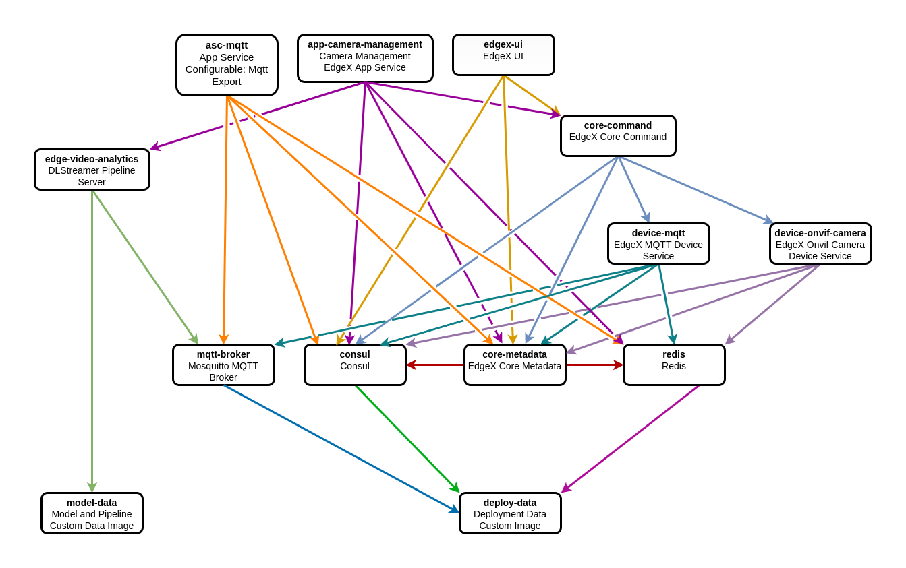

# EdgeX Foundry Kamakura w/ Onvif Device Service + Edge Video Analytics
Deployment files for running EdgeX Kamakura with the onvif device service, as well
as Intel's Edge Video Analytics on the Open Horizon platform.

## Environment
The following environment variables **must** be set in order to run the make scripts.
```shell
# Sets the scope so that multiple users can use the same instance
export EDGE_OWNER=<sg.edge>
# Lets you manage and deploy different group of code across dev, demo, test, prod or project
export EDGE_DEPLOY=<dev>
export HZN_ORG_ID=<org_id>
export HZN_EXCHANGE_USER_AUTH=iamapikey:<your-iamapikey>
export APP_BIND_HORIZON_DIR=/var/local/horizon
# This is the docker registry/account where locally-built images are pushed to
export LOCAL_DOCKER_REGISTRY=<your-docker-registry-base>
```

### Versions
Update [versions.mk](versions.mk) to point to the correct version of each service, and all the
pattern and service definitions will automatically reference the new version.

### Misc
Check [defaults.mk](defaults.mk) for various env vars you can override.
Optionally you can add a file called `env.mk` and set your overrides in there.

## Publish
Right now, because the `device-onvif-camera`, `deploy-data`, and `model-data` docker images are not 
in a docker registry, the make scripts will automatically push them to a registry defined via
`LOCAL_DOCKER_REGISTRY`. If you wish, you can run a local docker registry at `localhost:5000` using the following
command:

```shell
docker run -d -p 5000:5000 --restart=always --name registry registry:2
```

### Publish all services and patterns
```shell
make all
```

### Register Node
#### User Input
- Copy the example [horizon/user-input.json](horizon/user-input.json) to the current directory.
- Modify and/or add any user input values you would like to be specified
- Make sure to use `USER_INPUT=<path to user-input.json>` when calling `make register`

#### Register
##### Setup
```shell
# Copy the example file horizon/user-input.json to current directory
cp -a horizon/user-input.json .

# Configure user-input.json values
vi user-input.json
```
#### Register (pick one)
```shell
# Register with default pattern
make register

# Register with default pattern and custom user input file
make register USER_INPUT=<path to user-input.json>

# Register with custom pattern and custom user input file
make register p=<pattern-name> USER_INPUT=<path to user-input.json>
```

#### Unregister
```shell
make unregister force-clean
```

## Service Dependency Diagram


## Networking limitations and issues
### Consul
By default, `consul` wants to bind to a local IP address as the `Cluster Address`. This is used
to communicate with other `consul` nodes on the network. `Consul` will fail with an error if there
is more than 1 private IPv4 address.

To get around this we tried binding to a network interface, such as `eth0`, however this does not
work because what happens when it is deployed is the `eth0` network is created as a sandbox network for
the service until other services that depend on it come alive. Once they do, they will start attaching their
networks to `consul`, and the management agent will remove the `eth0` interface, causing issues.

How we are getting around this is to use localhost `127.0.0.1` as the `-bind` address / `Cluster Address` address 
(keep in mind this is different from the `-client` address). Essentially this keeps `consul` happy, but more investigation
is needed to see if there is a way to disable that feature altogether, or if using `127.0.0.1` is causing
some unforeseen consequence.

## Pattern limitations and issues
Open Horizon expects a pattern to be created with only the top-level services
(those services which do not have anything that depends on them). If you add all the services
including the top-level as well as dependency services, weird issues occur, you will observe
instability, missing network links, and more.

## Implementation Details
- We aren't making all services depend on `deploy-data`, just the lowest level ones (`consul`, `redis`, `mqtt-broker`).
The reason for this is that we do not need any network connections to it (we just want it started first).

- We are using a custom `wait.sh` script for services to wait for certain dependent network and ports to be
available before starting the services.

### Json Pre-processing
You may have noticed that some `.json` files have comments in them, in the form of `// comment...`.
Normally, json files do not allow comments in them, so what the `make` commands do is pre-process
the json file to get rid of any lines starting with 0 or more whitespace followed by `//`.

### Deploy Container
This container is used to deploy a set of scripts and configuration files that are (semi-)constant, but not
built into the docker images. It is also responsible for creating the `APP_BIND_HORIZON_DIR`, and making it 
read-writeable by the other containers.

Each file that does not start with a `shebang` (`#!`) is passed to `envsubst` on the target deployed
system. What this means is that you can create a file that is configurable based on the deployment.

However, keep in mind that the `envsubst` is happening based on the environment of the `deploy-data`
container, and not necessarily the container that is going to be consuming the files.

### Model Data Container
For now, we are using a `model-data` service which is similar to the `deploy-data` service except that it only
contains models and pipelines as input to the `edge-video-analytics` service.
