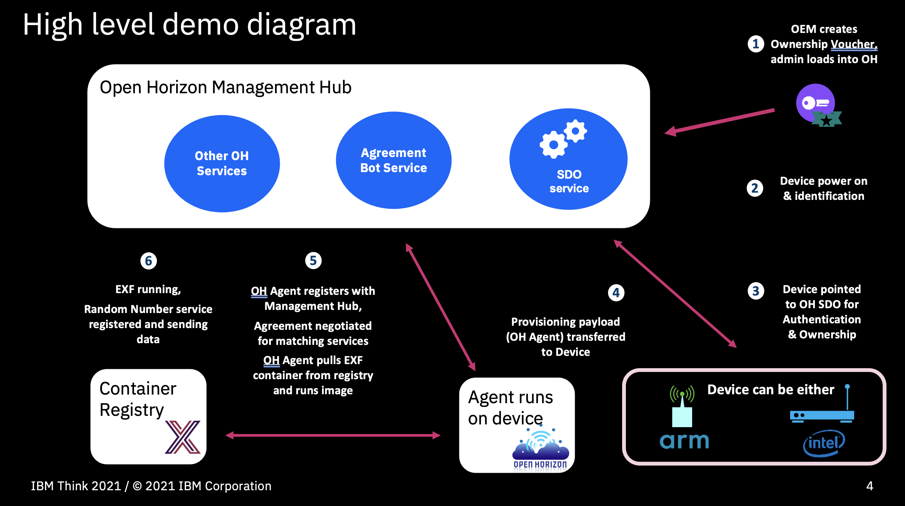

# Demonstration of SDO, OH, and EXF

## Introduction

This is a simple demonstration geared towards developers.  It begins with the Open Horizon all-in-one installation (including SDO services) in a single VM.  Running the modified [SDO script](https://github.com/open-horizon/SDO-support/blob/master/README-1.10.md#open-horizon-sdo-110), it will boot a simulated device and then install and configure an Open Horizon Agent.  The Agent will then contact the Management Hub and receive a proposed agreement to install and run an EdgeX Foundry (EXF) instance.  EXF, in turn, will be configured to run a Random Number Device service.



## Requirements

* An x86_64/amd64-based VM with Ubuntu 18.04 Server, 1 vCPU, 4GB RAM, and 20GB disk

If you have independently verified the instructions on a system, please send us the configuration to add to the list below:

1. HP MP9 G4 system with Intel Core i7 processor, 16GB memory, 500 GB storage, and Ubuntu 18.04.5 desktop

## Instructions

### Step One: Prepare the OS

> NOTE: Watch the video of [setting up a VM with VirtualBox](https://www.youtube.com/watch?v=YQqFnRNL98s) if you haven't done that before or would like a refresher.

* Boot the VM and log in.  Become root with `sudo -i`.
* **Optional** - Update the OS and install any pre-requisites
``` shell
apt-get -y update
apt-get -y upgrade
apt-get -y install jq
```

### Step Two: Install Open Horizon Management Hub and Agent

> If Open Horizon is already installed and configured properly, skip step two and go straight to step three instead.
> NOTE: This step will install docker and docker-compose if they are not already present.

* **Optional** - Determine the VM's local IP address and `export HZN_LISTEN_IP=<local-IP-address-here>` if the network connection is bridged, otherwise use the loopback address of 127.0.0.1 instead.  If the IP address is accessible outside of the VM, then you will be able to connect to any exposed ports from outside the VM.  Without this step, the services will only be available inside the VM.
* Install the all-in-one Open Horizon instance by following [these instructions](https://github.com/open-horizon/devops/tree/master/mgmt-hub).
* **NOTE** Save the credentials shown at the end of the installation process.  You will need these later.
* Set the following environment variables to connect to the Exchange and to allow publishing.  Replace the `<values>` with the actual value indicated.  Also add them to your shell's RC file if you'd like them to persist beyond this session.
``` shell
export HZN_ORG_ID=myorg
export HZN_EXCHANGE_USER_AUTH=admin:<insert value from installation credentials>
export HZN_DEVICE_TOKEN=<insert value from installation credentials or use random string>
export HZN_DEVICE_ID=node1
export HZN_EXCHANGE_URL=http://<local-IP-address-here>:3090/v1/
export HZN_FSS_CSSURL=http://<local-IP-address-here>:9443/
```

### Step Three: Configure and publish the definition files for the EXF Service

> NOTE: this is based on the [Open Horizon / EdgeX Foundry integration project](https://github.com/edgexfoundry-holding/open-horizon-integration/blob/master/hub/README.md).

* Clone the [ORRA repository](https://github.com/edgexfoundry-holding/orra) and navigate to the SDO-OH-EXF demo folder:
``` shell
git clone https://github.com/edgexfoundry-holding/orra.git
cd orra/demos/SDO-OH-EXF-dev-simple
```
* Publish the service and pattern:
``` shell
hzn exchange service publish -P -f configuration/service.json
hzn exchange pattern publish -f configuration/pattern.json
```
* Create the temporary and configuration folders, copy the EdgeX Foundry service configuration patterns to their expected location:
``` shell
mkdir -p /var/run/edgex/logs
mkdir -p /var/run/edgex/data
mkdir -p /var/run/edgex/consul/data
mkdir -p /var/run/edgex/consul/config
mkdir -p /root/res
chmod -R a+rwx /var/run/edgex
chmod -R a+rwx /root/res
cp res/* /root/res
```
* Publish the deployment policy:
``` shell
hzn exchange deployment addpolicy -f configuration/deployment.policy.json myorg/policy-com.github.joewxboy.horizon.edgex_1.0.1
```

### Step Four: Edit and run the SDO script

When the all-in-one Open Horizon instance is run in Step Two, it creates a local copy of both `deploy-mgmt-hub.sh` and `test-sdo.sh`.  You will now be editing the latter file to have it deploy and run EdgeX Foundry.

* Return to the folder where you ran the all-in-one Open Horizon installer. If you went through Step Two above, you should be able to get there with:
``` shell
cd ../../..
```
* Edit the `test-sdo.sh` script that came with the all-in-one Open Horizon install and change the following lines:
    * Towards the end, the line: `hzn voucher import /var/sdo/voucher.json --policy node.policy.json`
    * Adjust the path and name of the policy file to `hzn voucher import /var/sdo/voucher.json --policy orra/demos/SDO-OH-EXF-dev-simple/configuration/node.policy`
    * A few lines later find this line: `/usr/sdo/bin/owner-boot-device ibm.helloworld`
    * Change the pattern from "ibm.helloworld" to `com.github.joewxboy.horizon.edgex`
* Run the test script:
``` shell
./test-sdo.sh
```

> NOTE: during this process the script will install required files, download the Open Horizon agent, run it, and then the agent will take over and contact Open Horizon to download and run EdgeX Foundry.  The FIDO Device Onboarding protocol will be communicating with the SDO services over a hundred times during this setup process.  It is not unusual to see WARN and ERROR messages as part of this process while still getting a successful installation.  When installation is complete, you can use the step below to confirm that all is running properly within EdgeX Foundry:

* Make a series of repeated requests every few seconds to the EdgeX endpoint for the Random Number Virtual Device (Control-C to stop):
``` shell
watch "curl --silent http://localhost:48080/api/v1/event | jq .[0].readings[0].value"
```
> NOTE: If the initial response is `null`, then the service has not yet run the first time.  Give it up to 20 seconds or so before expecting to see an Integer value returned.  Thereafter, it should update every 5-10 seconds.

### Step Five: Optionally, clean up

* To unregister the service:
``` shell
hzn unregister -f
```
* To remove Agent and Management Hub
``` shell
./deploy-mgmt-hub.sh -S
```
